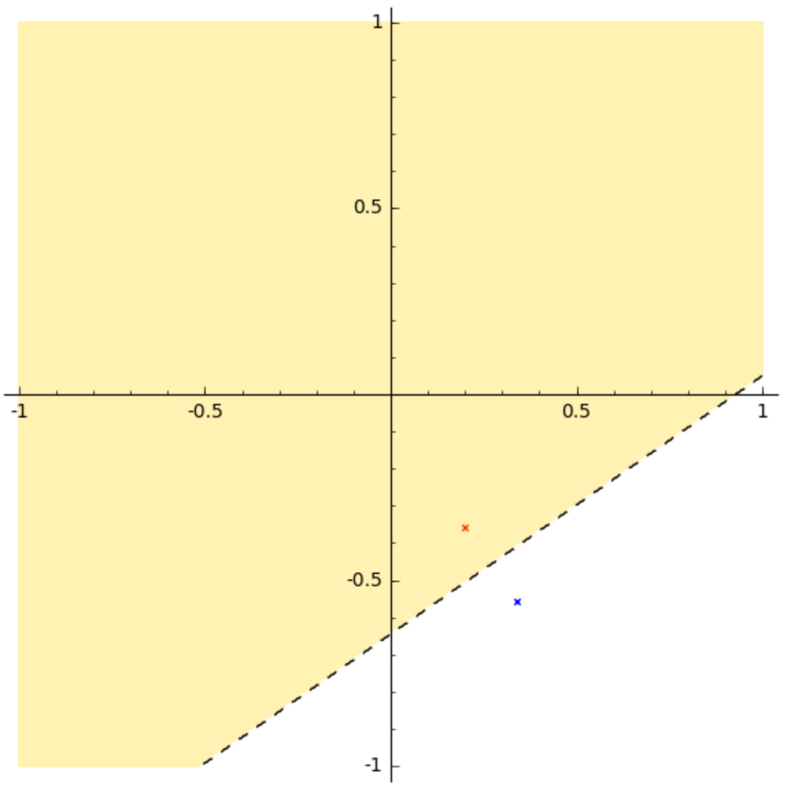

$\newcommand{\R}{\mathbb{R}}$
$\newcommand{\scalar}[2]{\langle #1,#2 \rangle}$

# Exercise 2.7

*Voronoi description of a halfspace*

Let $a$ and $b$ be distinct points in $\R^n$. Show that the set of all points that are closer in Euclidean norm to $a$ than $b$ is a halfspace. Describe it explicitly as an inequality of the form $c^T x \leq d$. Draw a picture.

 <details> 
  <summary>**Solution**. (MF)</summary>

Let $V_a = \{ x \in \R^n : ||x-a||_2 \leq ||x-b||_2 \}$. The set $V_a$ is corresponds to all points that are closer to $a$ than to $b$. Expanding
$$
\scalar{x-a}{x-a} \leq \scalar{x-b}{x-b},
$$
we find after some algebra that
$$
\scalar{b-a}{x}\leq \dfrac{||b||^2_2 - ||a||^2_2}{2}.
$$
Consequently, $V_a$ is the polyhedron $V_a = \{ x \in \R^n : c^T x \leq d \}$, with $c = b-a \in \R^n$, and $d = \dfrac{||b||^2_2 - ||a||^2_2}{2}$.

For the draw, let us consider two random points in the square $[-1,1]^2$, and build the polyhedron that we have just found.

```python
a = random_vector(RR, 2, min = -1, max = 1)
b = random_vector(RR, 2, min = -1, max = 1)

norm2 = lambda x : sqrt(sum(xi*xi for xi in x))

d = (norm2(b)^2-norm2(a)^2)/2
c = b - a

# plot the points a and b
drawing = point(a, color='red', marker='x') + point(b, color='blue',marker='x')

# plot the region, with some (optional) formatting tweaks
drawing += region_plot(lambda x, y: c[0]*x + c[1]*y <= d ,(-1,1),(-1,1), 
                       incol='gold', bordercol='black', borderstyle='dashed', 
                       plot_points=500, aspect_ratio=1, alpha=0.3)

drawing.show()
```

The plot shows that the set $V_a$ defined above corresponds to the region in yellow, closer to the point $a$ (in red) than $b$ (in blue).




</details>


