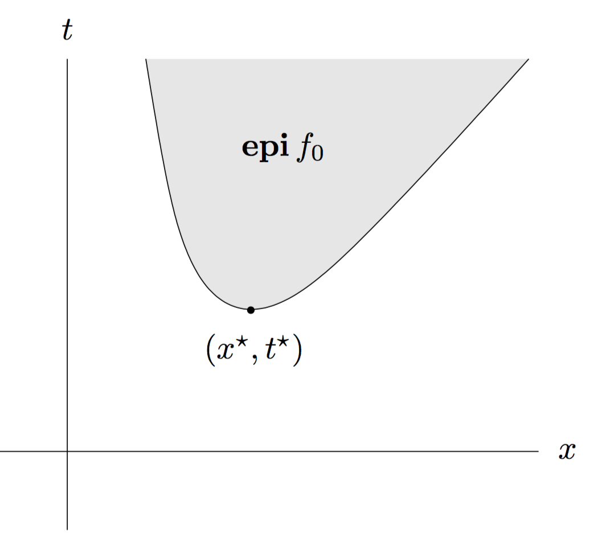
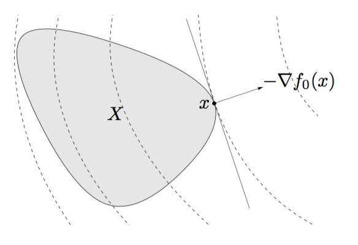
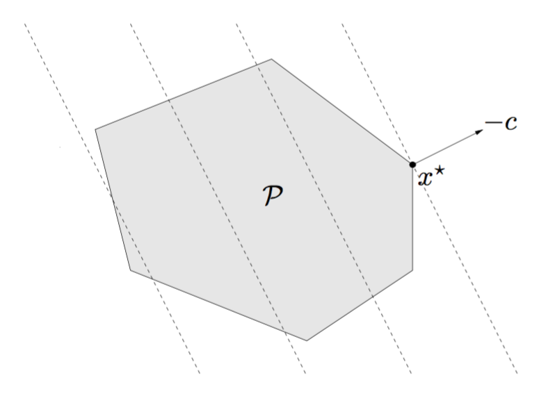

% Convex optimization problems
% [Marcelo Forets](http://marcelo-forets.fr/), Univ. Grenoble Alpes.
% [Optimization and Control Reading Group](https://project.inria.fr/readinggroupoc/). France, Jan' 2017.  

# Overview of the chapter

$\def\S{\mathbf{S}}$
$\def\A{\mathbf{A}}$
$\def\b{\mathbf{b}}$
$\def\B{\mathbf{B}}$
$\def\K{\mathbf{K}}$
$\def\G{\mathbf{G}}$
$\def\S{\mathbf{S}}$
$\def\V{\mathbf{V}}$
$\def\X{\mathbf{X}}$
$\def\Y{\mathbf{Y}}$
$\def\x{\mathbf{x}}$
$\def\y{\mathbf{y}}$
$\def\p{\mathbf{p}}$
$\def\z{\mathbf{z}}$
$\def\M{\mathbf{M}}$
$\def\Q{\mathbf{Q}}$
$\newcommand{\R}{\mathbb{R}}$
$\newcommand{\C}{\mathbb{C}}$
$\newcommand{\N}{\mathbb{N}}$
$\newcommand{\red}[1]{\textbf{{\color{red}#1}}}$


- Optimization problems
- Convex optimization
- Linear optimization problems (LP)
- Quadratic optimization problems (QP, QCQP)
- Geometric programming
- Generalized inequality constraints (LMI)
- Vector optimization
- Exercises


# Warm-up

Would you call this a *convex optimization* problem?

$$
\begin{equation}
\begin{aligned}
\text{minimize}\quad & f_0(x) = x_1^2 + x_2^2\\
\text{subject to}
\quad &f_1(x) = x_1/(1+x_2^2) \leq 0,\\
\quad &h(x) = (x_1+x_2)^2 = 0.
\end{aligned}
\end{equation}
$$

<details>
<summary> Hint. </summary>

Let's plot $f_1(x_1, x_2)$:

```python
var('x1 x2')
f = x1/(1+x2^2)

# show 3d plot in [-10, 10]^2
plot3d(f, (x1, -10, 10), (x2, -10, 10), adaptive=True)
```


</details>

<details>
<summary> Discussion. </summary>

Recall that: $f$ is convex iff it is convex along lines, that is, for all vectors $x$ and $v$, the function $g(t)=f(x+vt)$ is convex, where $t \in \{\xi : x+v\xi \in \textrm{dom }f\}.$ This suggests to define a line and prove that the function is not convex along this line. The picture tells that a good candidate is at the point $x = (1,0)^T$, and for the direction we choose $v = (0, 1)^T$. Then,
$$
g(t) = f(x+vt) = 1/(1+t^2).
$$
This function is bell-shaped, and is not convex.

However, the problem can be reformulated as:

$$
\begin{equation}
\begin{aligned}
\text{minimize}\quad & f_0(x) = x_1^2 + x_2^2\\
\text{subject to}
\quad &\bar{f_1}(x) = x_1 \leq 0,\\
\quad &\bar{h}(x) = x_1+x_2 = 0.
\end{aligned}
\end{equation}
$$

Clearly, we are optimizing a convex function over a convex set.

In Boyd's book, former system is said to be (just) a *standard optimization problem*, while the latter is said to be a *convex optimization problem in standard form.* Thus, in the terminology of the book, in a convex optimization problem is required that the feasible set is described by a set of inequalities involving convex functions, and a set of affine equality constraint functions.

</details>

# Optimization problems

$$
\begin{equation}
\begin{aligned}
\text{minimize}\quad & f_0(x) \\			
\text{subject to}
\quad &f_i(x) \leq 0, ~~ i = 1,\ldots,m\\
\quad &h_i(x) = 0, ~~  i = 1,\ldots,p \,.
\end{aligned}
\end{equation}
$$

- *Optimal value*: $p^\ast := \inf \{f_0(x): x \text{ is feasible }  \}$
- *Optimal set*: $X_{opt} := \{ x :  x \text{ is feasible and } f_0(x)=p^* \}$

<details>
<summary> Terminology. </summary>

- $x \in \R^n$ : *optimization variable*
- $f_0 : \R^n \to \R$ : *objective function*
- $f_i : \R^n \to \R$, $f_i(x) \leq 0$ : *inequality constraints*
- $h_i: \R^n \to \R$, $h_i(x) = 0$ : *equality constraints*
- $\mathcal{D} := \bigcap_{i=0}^m \text{dom }f_i \cap \bigcap_{i=0}^p \text{dom }h_i$ is the *domain of the optimization problem*.
- $x \in \mathcal{D}$ is *feasible* if it satisfies all the constraints.
</details>

<details>
<summary> Toy examples. </summary>

Here $\text{dom } f = \mathbb{R}_{>0}$ and the problems are unconstrained:

- $f_0(x) = 1/x$, $p^*=0$ (but the optimal value is not achieved)
- $f_0(x) = -\log x$, $p^* = -\infty$ (problem is unbounded below)
- $f_0(x) = x \log x$, $p^*=-1/e$ ($\exists$ unique optimal point $x^*=1/e$)

</details>

# Expressing problems in standard form

$$
\begin{equation}
\begin{aligned}
\text{minimize}\quad & f_0(x) \\			
\text{subject to}
\quad &f_i(x) \leq 0, ~~ i = 1,\ldots,m\\
\quad &h_i(x) = 0, ~~  i = 1,\ldots,p \,.
\end{aligned}
\end{equation}
$$

- may require **rearranging** the rhs (e.g. to handle box constraints, $l_i \leq x_i \leq h_i$).
- **maximization** is handled by minimizing $-f_0(x)$ subject to the same constraints.


# Equivalent problems: elementary methods

$$
\begin{equation}
\begin{aligned}
\text{minimize}\quad & f_0(x) \\			
\text{subject to}
\quad &f_i(x) \leq 0, ~~ i = 1,\ldots,m\\
\quad &h_i(x) = 0, ~~  i = 1,\ldots,p \,.
\end{aligned}
\end{equation}
$$

- **slack variables**: to replace an inequality constraint by an equality constraint and a nonnegativity constraint (since $f_i(x)\leq 0$ iff $\exists s_i\geq 0$ satisfying $f_i(x)+s_i = 0$).
- **change of variables**: any $\phi : \R^n  \to \R^n$, injective and $\text{Im } \phi \supseteq \mathcal{D}$ can be used as in $\tilde{f_i}(z) = f_i(x)$, with the change of variable $x = \phi(z)$.
- **scaling**: as in $\tilde{f_i}(x) = \alpha_i f_i(x)$, give problems that are equivalent in the sense that we can recover the solution of one form that of the other and vice-versa.
- **generalized scaling**: given $\psi_0$ monotonically increasing, $\psi_{1\leq i \leq m} : \psi_i(u)\leq 0$ iff $u\leq 0,$ and $\varphi_{1\leq i \leq p}: \varphi_i(u)=0$ iff $u=0,$ then define: $\tilde{f_i}(x) = \psi_i(f_i(x))$ and $\tilde{h}_i(x) = \varphi_i(h_i(x))$.


<details>
<summary> Examples. </summary>

- *Transforming to a differentiable problem:* $\min \Vert Ax-b \Vert_2$ vs. $\min (Ax-b)^T(Ax-b)$.
- *Eliminating equality constraints:* if we know $\phi : \R^k \to \R^n$ such that $h_i(x)=0$ iff for some $z\in \text{dom } \phi$, we have $x = \phi(z)$, then we can transform via $\tilde{f_i}(z) = f_i(\phi(z))$, eliminating the equality constraints. A particular instance is the case $h_i: a_i^T x = b_i$.
- *Optimizing over some variables:* consists in simplifying the problem by using the principle $\inf_{x, y}f(x, y) = \inf_x \tilde{f}(x)$, where $\tilde{f}(x) = \inf_y f(x, y)$.

</details>


# Epigraph problem form

- Recall that: $\text{epi} (f) = \{(x, t) : x \in \text{dom } f \text{ and } f(x) \leq t \}$.

. . .

- The standard problem can be reformulated in the variable $y = (x,t) \in \R^{n+1}$ as:

$$
\begin{equation}
\begin{aligned}
\text{minimize}\quad & t \\			
\text{subject to}
\quad &f_0(x) - t \leq 0, \\
\quad &f_i(x) \leq 0, ~~ i=1,\ldots,m\\
\quad &h_i(x) = 0, ~~  i = 1,\ldots,p \,.
\end{aligned}
\end{equation}
$$


- It can be seen as an optimization problem in the "graph space" $(x, t)$:



<details>
<summary> Example (polynomial optimization). </summary>

Consider a univariate polynomial $p : \R \to \R$, $p \in \R_{2k}[t]$, and let $x = \text{vec } p \in \R^{2k+1}$. The polynomial optimization problem:

$$
\begin{equation}
\begin{aligned}
\text{maximize}\quad & \inf_t p(t) \\			
\text{subject to}
\quad &l_i \leq p(t_i) \leq u_i, ~~  i = 1,\ldots,m \,.
\end{aligned}
\end{equation}
$$
can be reformulated via epigraph form as:
$$
\begin{equation}
\begin{aligned}
\text{maximize}\quad & \gamma \\			
\text{subject to}
\quad &p(t) - \gamma \geq 0, ~~ t \in \R \\
\quad &l_i \leq p(t_i) \leq u_i, ~~  i = 1,\ldots,m \,.
\end{aligned}
\end{equation}
$$

The interest in this reformulation is that we recover a *nonnegative polynomial constraint* $p(t) - \gamma \geq 0.$ The characterization of nonnegative polynomials via linear-matrix inequalities can be applied in this setup (see Exercise 3).

</details>


# Convex optimization problems

$$
\begin{equation}
\begin{aligned}
\text{minimize}\quad & f_0(x) \\			
\text{subject to}
\quad &f_i(x) \leq 0, ~~ i = 1,\ldots,m\\
\quad &a^T_i x = b_i, ~~  i = 1,\ldots,p \,.
\end{aligned}
\end{equation}
$$
where $f_0,\ldots,f_m$ are convex functions.

Two key remarks:

1. the feasible set of a convex optimization problem is convex.
2. any locally optimal point is also globally optimal.

<details>
<summary> Proof of 1.</summary>

Recall that intersection is an operation that preserves convexity. The feasible set is the intersection of:

- the domain $\mathcal{D} = \bigcap_{i=0}^m \text{dom } f$, a convex set;
- $p$ hyperplanes;
- $0$-sublevel sets of the $m$ functions $f_i(x)$ (which are convex, as a consequence of $f_i$ being convex).

Hence, the feasible set is convex.

</details>

<details>
<summary> Proof of 2. </summary>

Suppose that $x \in \mathcal{D}$ is locally optimal, that is, $x$ is feasible and
$$
f_0(x) = \inf \{ f_0(z) : z \text{ is feasible and } \Vert z-x \Vert_2 \leq R\}
$$
for some $R > 0$. Suppose that $x$ is not globally optimal: assume there is a feasible $y$, such that $f_0(y) < f_0(x)$; by hypothesis we have $\Vert y-x \Vert_2 > R$. By convexity of the feasible set, for any $\theta \in [0, 1]$,
$$
z = (1-\theta)x + \theta y
$$
is feasible. Pick $\theta = \frac{R}{2\Vert y-x \Vert_2} < 1$, then we have
$$
\Vert z-x \Vert_2 = \theta \Vert y-x \Vert_2=\frac{R}{2} < R,
$$
hence $f_0(z)\geq f(x)$ by hypothesis.

On the other side, by convexity of $f_0$, we have
$$
f_0(z) \leq (1-\theta) f_0(x) + \theta f_0(y) < f_0(x),
$$
a contradiction.


</details>

# Optimality criterion using 1st order condition

$$
\begin{equation}
\begin{aligned}
\text{minimize}\quad & f_0(x) \\			
\text{subject to}
\quad &f_i(x) \leq 0, ~~ i = 1,\ldots,m\\
\quad &a^T_i x = b_i, ~~  i = 1,\ldots,p \,.
\end{aligned}
\end{equation}
$$

**Proposition.** If $f_0$ is differentiable, then, $x$ is optimal iff $x$ is feasible and $\nabla f_0(x)^T(y-x)\geq 0$ for all feasible $y.$



**Corollary.** If the problem is unconstrained, then the optimality condition simplifies to $\nabla f_0(x) = 0$.

<details>
<summary> Proof of the optimality condition. </summary>

Recall the 1st order condition: suppose $f$ is differentiable (that is, $\nabla f(x)$ exists for all $x$ in its domain). Then $f_0$ is convex iff $\text{dom } f$ is convex and for all $x, y \in \text{dom } f$, it holds
$$
f(y) \geq f(x) + \nabla f(x)^T(y-x).
$$

Let $X$ denote the feasible set.

- ($\impliedby$) Suppose that $x \in X$ and that $\nabla f_0(x)^T (y-x) \geq 0$ for all $y\in X$. From the first order condition, we get $f(y)-f(x) \geq 0$ for all $y\in X$, hence $x$ is an optimal point.

- ($\implies$) We proceed by contradiction: assume $x \in X$ is optimal, and there exists $y \in X$ such that $\nabla f_0(x)^T (y-x) < 0$. For each $t \in [0, 1]$, the point $z(t) = ty + (1-t)x$ is feasible, by convexity of $X$. Then,
$$
\left. \frac{d}{dt}f_0(z(t)) \right\rvert_{t=0} = \nabla f_0(x)(y-x) < 0
$$
by hypothesis, but this implies that for small positive $t$, $f_0(z(t))<f_0(x)$, a contradiction.

</details>

<details>
<summary> Proof of the corollary. </summary>

If $x \in \text{dom } f$ is optimal, then for all feasible $y \in \text{dom } f$, it holds
$$
f(y) \geq f(x) + \nabla f(x)^T(y-x).
$$
We can take $y = x-t\nabla f_0(x)$ with small positive $t$, which is in the domain of $f$ because $\text{dom f}$ is open, and is feasible for sufficiently small $t$. Hence,
$$
\nabla f(x)^T(y-x) = -t \Vert \nabla f_0(x)\Vert_2^2 \geq 0,
$$
hence $\nabla f_0(x)$ must vanish.


</details>

# Optimality criterion using Lagrange multipliers

$$
\begin{equation}
\begin{aligned}
\text{minimize}\quad & f_0(x) \\			
\text{subject to}
\quad &Ax = b, ~~  A \in\R^{p\times n}, b \in \R^p \,.
\end{aligned}
\end{equation}
$$
Assume $f_0$ is differentiable, and $x$ is optimal.

- for feasible $x, y$, we must have $y-x = z \in \ker A$.

- from $\nabla f_0(x)^T(y-x)\geq 0$, we have that $\nabla f_0(x)\perp \ker A$.

- recall that $(\ker A)^\perp = \text{ran } A^T$ and let $\dim (\ker A) = k$.

- we deduce that there exists $\nu \in \R^k$ such that
$$
\nabla f_0(x) + A^T v = 0
$$
for all feasible $x$.

# Linear optimization problems (LP)

. . .

$$
\begin{equation}
\begin{aligned}
\text{minimize}\quad & c^T x + d \\			
\text{subject to}
\quad &Gx \preceq  h \\
\quad &Ax = b\,.
\end{aligned}
\end{equation}
$$
where $G \in \R^{m\times n}$, and $A \in \R^{p\times n}$.

- the objective and all constraint functions are *affine.*

- geometrically: minimize an affine function over a *polyhedron* $\mathcal{P}$.



Two equivalent formulations:

- *Standard form LP*:
$$
\begin{equation}
\begin{aligned}
\text{minimize}\quad & c^T x  \\			
\text{subject to}
\quad &Ax = b\\
\quad &x \succeq 0 \\
\end{aligned}
\end{equation}
$$

- *Inequality form LP*:
$$
\begin{equation}
\begin{aligned}
\text{minimize}\quad & c^T x  \\			
\text{subject to}
\quad &Ax \preceq b.
\end{aligned}
\end{equation}
$$


# Quadratic optimization problems (QP, QCQP)

. . .

$$
\begin{equation}
\begin{aligned}
\text{minimize}\quad & \frac{1}{2} x^T P x + q^Tx + r\\			
\text{subject to}
\quad &Gx \preceq  h \\
\quad &Ax = b\,.
\end{aligned}
\end{equation}
$$
where $P \in S^n_+$, $G \in \R^{m\times n}$, and $A \in \R^{p\times n}$.

- the objective is (convex) *quadratic*, and all constraints are *affine.*

- geometrically: minimize a convex quadratic function over a *polyhedron* $\mathcal{P}$.


**Two related problems:**

- *Quadratically constrained quadratic program*: (QCQP)

$$
\begin{equation}
\begin{aligned}
\text{minimize}\quad & \frac{1}{2} x^T P_0 x + q_0^Tx + r_0\\			
\text{subject to}
\quad &\frac{1}{2} x^T P_i x + q_i^Tx + r_i\leq 0,~i=1,\ldots,m\\
\quad &Ax = b\,.
\end{aligned}
\end{equation}
$$
where $P_i \in S^n_+$, $G \in \R^{m\times n}$, and $A \in \R^{p\times n}$. When $P_i$ are positive definite, the feasible region is the *intersection of ellipsoids*.

- *Second-order cone programming*: (SOCP)

$$
\begin{equation}
\begin{aligned}
\text{minimize}\quad & f^T x\\			
\text{subject to}
\quad &\Vert A_i x + b_i\Vert_2 \leq c_i^T x + d_i,~i=1,\ldots,m\\
\quad &Ax = b\,.
\end{aligned}
\end{equation}
$$
where $A_i \in R^{n_i \times n}$, $F \in \R^{p\times n}$, and $x \in \R^n$.  


# Geometric programming

. . .

$$
\begin{equation}
\begin{aligned}
\text{minimize}\quad & f_0(x)\\			
\text{subject to}
\quad &f_i(x)\leq 1,\qquad i=1,\ldots,m \\
\quad &h_i(x) = 1,\qquad i=1,\ldots,p \,.
\end{aligned}
\end{equation}
$$
where $f_i$ are *posynomials* and $h_i$ are *monomials*. The domain is $\mathcal{D}=\R^n_{>0}$.

<details>
<summary> Terminology. </summary>

- A *monomial* is a function $f : \R^n \to \R$, $\text{dom } f = \R^n_{>0}$, defined as
$$
f(x) = cx_1^{a_1}\cdots x_n^{a_n},
$$
$c>0$, $a_i \in \R$. (note that it differs from the usual notion of monomial).

- A *posynomial* function with $K$ terms is a sum of monomials, namely
$$
f(x) = \sum_{k=1}^K c_k x_1^{a_{1k}}\cdots x_n^{a_{nk}}, \qquad c_k > 0.
$$

</details>

- Posynomials are closed under addition, multiplication, and nonnegative scaling.

- Geometric programs are not convex in their natural form, but can be **transformed** into convex optimization problems by suitable change of variables and a transformation of the objective and constraint functions.


# Generalized inequality constraints

. . .

$$
\begin{equation}
\begin{aligned}
\text{minimize}\quad & f_0(x)\\			
\text{subject to}
\quad &f_i(x) \preceq_{K_i} 0,\qquad i=1,\ldots,m \\
\quad &Ax = b\,.
\end{aligned}
\end{equation}
$$
where $f_0 : \R^n \to \R$, $K_i \subseteq \R^{k_i}$ are *proper cones*, and $f_i : \R^n\to \R^{k_i}$ are $K_i$-convex.

- Our general standard convex optimization problem is a special case with $K_i = \R_+$.

- The feasible set, any sublevel set, and optimal set **are convex**.

- Any locally optimal point **is globally optimal**.

- The first order **optimality condition holds.**

<details>
<summary> Two important instances: CP and SDP </summary>

- *Cone programs:*

$$
\begin{equation}
\begin{aligned}
\text{minimize}\quad & c^T x\\			
\text{subject to}
\quad &Fx + g \preceq_{K} 0 \\
\quad &Ax = b\,.
\end{aligned}
\end{equation}
$$
They generalize LP in the sense that componentwise inequality is replaced with a generalized linear inequality.

- *Semidefinite programming:*

$$
\begin{equation}
\begin{aligned}
\text{minimize}\quad & c^T x\\			
\text{subject to}
\quad &x_1 F_1 + \cdots + x_n F_n + G \preceq 0 \\
\quad &Ax = b\,.
\end{aligned}
\end{equation}
$$
where $K = S_+^k$, $G, F_i \in S^k$, and $A \in \R^{p\times n}$. The inequality here is a **linear matrix inequality (LMI).**

</details>

# Vector optimization

$$
\begin{equation}
\begin{aligned}
\text{minimize}\quad & f_0(x) \\			
\text{subject to}
\quad &f_i(x) \leq 0, ~~ i = 1,\ldots,m\\
\quad &h_i(x) = 0, ~~  i = 1,\ldots,p \,.
\end{aligned}
\end{equation}
$$
where the minimization is taken with respect to a proper cone $K\subseteq \R^q$, $x \in \R^n$ is the optimization variable, $f_0 : \R^n \to \R^q$ is a **vector** objective function, $f_i : \R^n \to \R$ are the inequality constraint functions, and $h_i:\R^n \to \R$ are equality constraint functions.

- The problem specification includes a proper cone $K$, which is used to compare objective values.
- For feasible $x, y$, we interpret $f_0(x) \preceq_{K} f_0(y)$ as meaning that $x$ is better than or equal in value to $y$, as judged by the objective function $f_0$ with respect to $K$. Note that in general, $x, y$ need not be comparable.

# Exercises


1. *Minimum fuel optimal control.* Exercise 4.16. (LP)
2. *Robust linear programming as a SOCP.* Section 4.4.2. (QP)
3. *Optimization over polynomials.* Exercise 4.44. (SDP)


. . .

## Proposal

- Make 3 groups. After some time, we share with all the group.
- Choose a programming language: Julia, Python, Matlab, Sage, ...

<details>
<summary> If you choose Julia... </summary>

- Go to JuliaBox: https://www.juliabox.com/
- If you just want to solve the exercise for robust LP, try to adapt your problem [using this example as template](https://github.com/JuliaOpt/juliaopt-notebooks/blob/master/notebooks/JuMP-ChebyshevCenter.ipynb)
- Or explore the available worked [introductory notebooks](https://github.com/JuliaOpt/juliaopt-notebooks/tree/master/notebooks).
- Or if you want a more complete, but still accessible path, [consider following this great intro to JuMP](https://github.com/JuliaOpt/juliaopt-notebooks/blob/master/notebooks/Shuvomoy%20-%20Getting%20started%20with%20JuMP.ipynb)

</details>

. . .

## Complement to the exercises

<details>
<summary> Complement to exercise 1. </summary>

Implement with this data:


Plot the actuator signal $u(t)$ as a function of $t$. Source: [Additional exercises in convex optimization.](https://web.stanford.edu/~boyd/cvxbook/bv_cvxbook_extra_exercises.pdf)

</details>

<details>
<summary> Complement to exercise 2. </summary>

Alternatively, you may implement the *Robust LP with interval coefficients.* Exercise 4.13.

</details>

<details>
<summary> Complement to exercise 3. </summary>

The problem can be reformulated as

$$
\begin{equation}
\begin{aligned}
\text{maximize}\quad & \gamma \\			
\text{subject to}
\quad &p(t) - \gamma \geq 0, ~~ t \in \R \\
\quad &l_i \leq p(t_i) \leq u_i, ~~  i = 1,\ldots,m \,.
\end{aligned}
\end{equation}
$$

An SDP can be obtained by using the LMI characterization of nonnegative polynomials from Chapter 2. It results in:

$$
\begin{equation}
\begin{aligned}
\text{maximize}\quad & \gamma \\			
\text{subject to}
\quad &x_1 - \gamma = Y_{11}, \\
\quad &x_i = \sum_{m+n=i+1} Y_{mn} \leq u_i, ~~  i = 2,\ldots, 2k+1 \\
\quad &l_i \leq \sum_i p(t_i) \leq u_i, ~~  i = 1,\ldots,m \\
\quad &Y \succeq 0 \,.
\end{aligned}
\end{equation}
$$
in the optimization variables $x \in \R^{2k+1}$, $\gamma \in \R$, $Y\in \S^{k+1}$.

Make plots of $p(t)$ to verify your solution.


</details>

. . .
